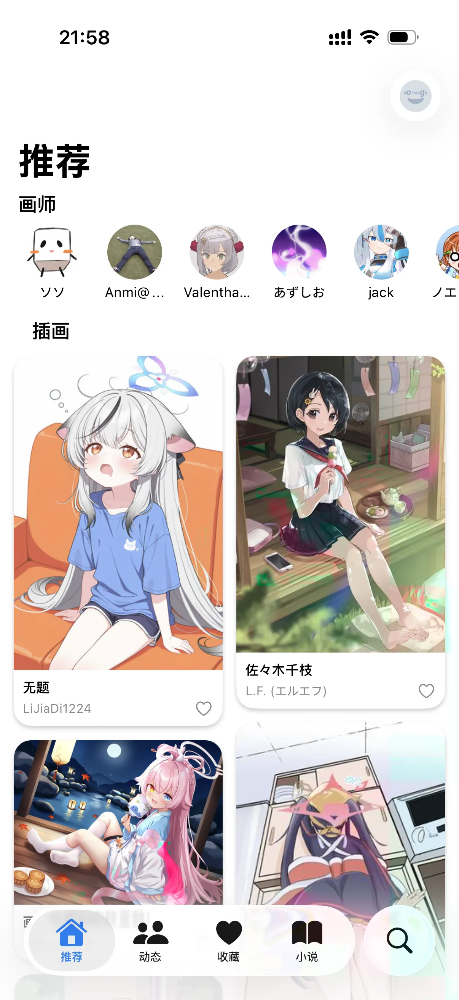
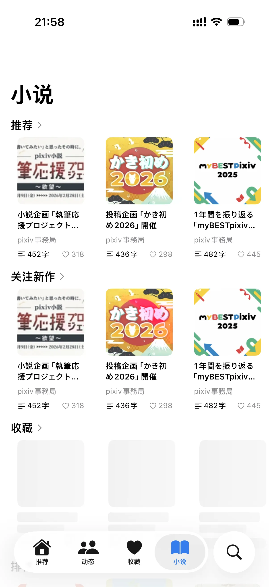
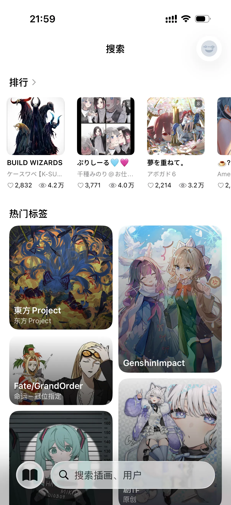
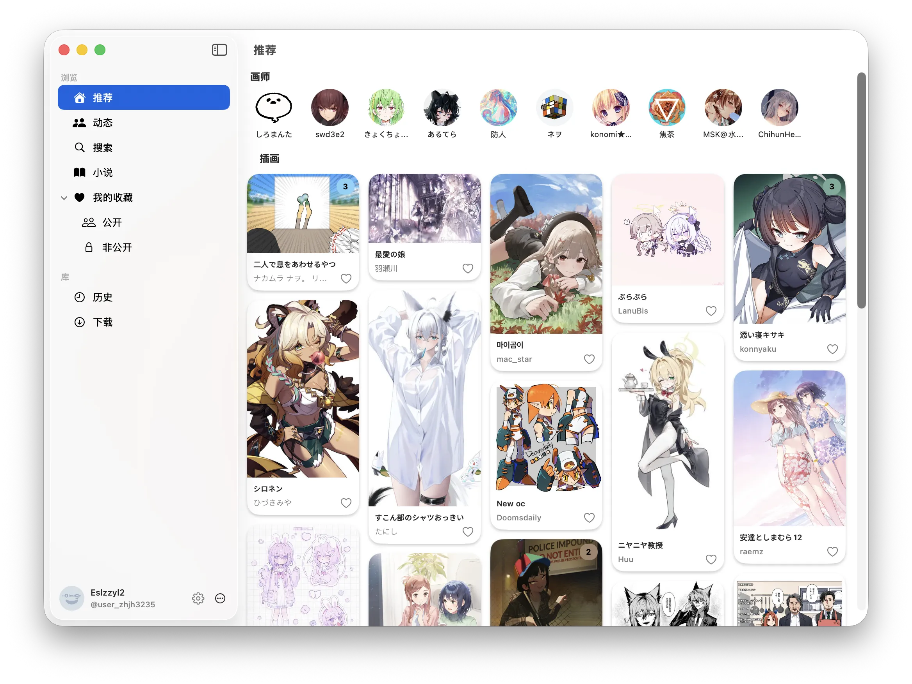
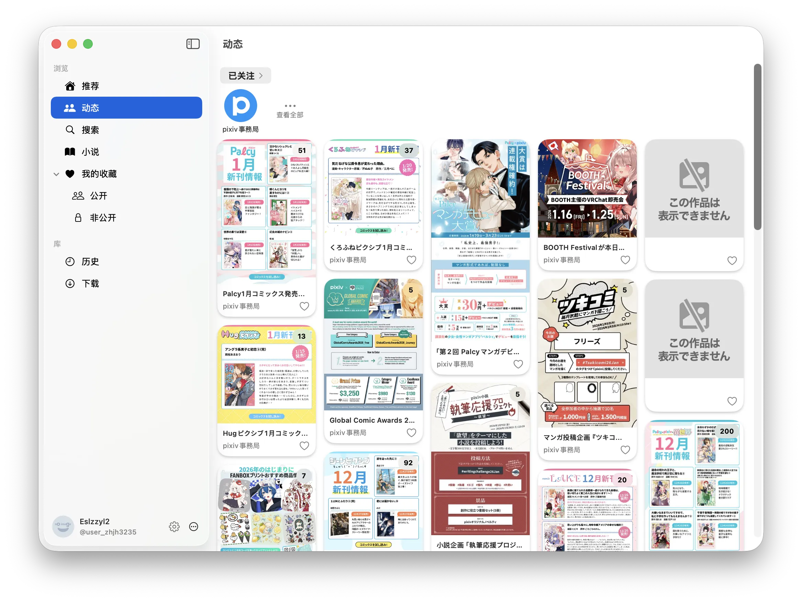
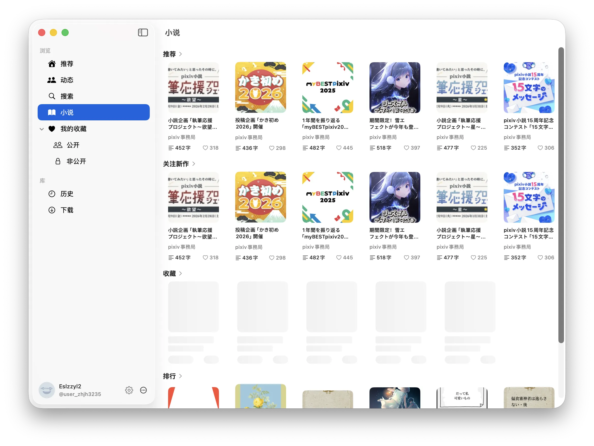
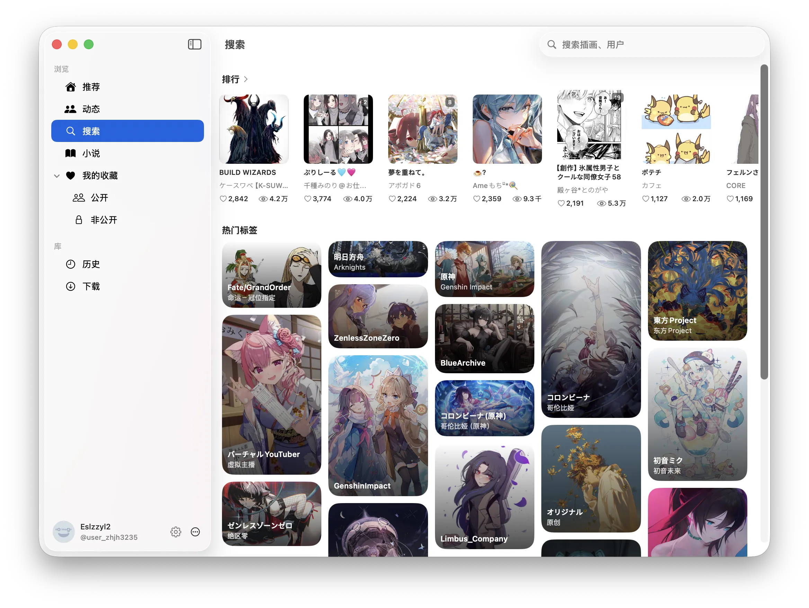

<div align="center">

<!-- App Icon with shadow and rounded corners -->
<p align="center">
  
</p>

<h1 align="center" style="margin-top: 16px;">Pixiv-SwiftUI</h1>

<p align="center">一个基于 SwiftUI 的 Pixiv 第三方客户端</p>

<!-- Badges -->
<p align="center">
  
  
  
  
</p>

</div>

---

> **声明**  
> 这是一个实验性的 Vibe Coding 项目：项目的**所有**代码均由大语言模型生成。开发者会尽力进行测试，但不能保证项目的可靠性。

---

## 功能特性

### 插画与漫画

- 推荐流：推荐和热门内容
- 排行榜：每日、每周、每月及性别分类排行榜
- 动图支持：ugoira 动图，允许设置自动播放和手动播放
- 收藏管理：公开/私密收藏
- 评论系统：查看和回复评论
- 用户主页：插画、漫画、小说、关注列表、用户信息

### 小说

- 推荐与排行榜
- 阅读器：流畅的阅读体验，支持进度记录
- 沉浸式翻译：可配置的翻译服务，支持双语对照
- 系列管理：小说系列浏览与阅读

### 搜索功能

- 综合搜索：插画、小说、用户一站式搜索
- 趋势标签：热门标签展示
- 搜索历史：记录与快速访问

### 翻译功能

- 支持翻译插画标题、简介，小说标题、简介，用户简介和所有评论
- 多翻译服务支持：可配置主要/备用翻译服务
- 智能语言检测：自动识别内容语言
- 沉浸式翻译：双语对照阅读模式

### 网络功能

- 直连模式：绕过 SNI 实现直连访问

### 下载与本地功能

- 图片下载：批量下载插画至相册
- 浏览历史：记录查看过的内容
- 数据导入/导出（兼容 pixez 格式）
- 实验性的插画收藏永久缓存：避免作者删图导致插画丢失

### 外观与体验

- 深色模式：自动/手动切换主题色
- 主题自定义：自定义强调色
- 布局适配：iPhone、Mac 优化布局（iPad 还有些问题）
- 缓存管理：图片缓存与存储清理
- 屏蔽设置：屏蔽标签、用户、具体插画
- R18/AI 过滤：正常显示、模糊显示、屏蔽、仅显示

## 系统要求

项目同时支持 iOS、iPadOS 和 macOS。

当前的支持情况：
- iOS 26.0 或更新版本：所有功能经过测试，可以正常工作。已知的 bug 除外。（测试机型： iPhone 17 模拟器/真机）
- iOS 18：粗略测试过，可以正常工作。（测试机型：iPhone 16e 模拟器）
- 更旧的 iOS 版本：目前暂无计划支持。
- iPadOS 26.0 或更新版本：所有功能应当都正常工作，但预计存在一些布局问题。
- 更旧的 iPadOS 版本：请参考 iOS
- macOS 26.0 或更新版本：所有功能经过测试，可以正常工作。已知的 bug 除外。
- macOS 15：没有测试过，但是应该可以正常工作。
- macOS 14：计划内支持，但目前不支持。
- 更旧的 macOS 版本：目前暂无计划支持。

## 安装方式

- iOS/iPadOS：到 Release 中下载最新版本的 ipa 包并使用 AltStore 等方式侧载安装。
- macOS：到 Release 中下载最新版本的 dmg 包并安装。安装包没有签名，可以执行以下命令来绕过：

```shell
sudo xattr -rd com.apple.quarantine /Applications/Pixiv-SwiftUI.app
```

## 特别鸣谢

- [pixez-flutter](https://github.com/Notsfsssf/pixez-flutter): 这是本项目的主要参考对象，大量参考了该项目的 API 和 UI 设计。pixez-flutter 是一个非常优秀的项目，遗憾的是在 iOS 设备上的异常发热问题长期未获得解决，这也是本项目诞生的主要动机。
- [Kingfisher](https://github.com/onevcat/Kingfisher): 提供图片加载和缓存
- [TranslationKit](https://github.com/Eslzzyl/TranslationKit): 提供翻译接口，同样是完全的 Vibe Coding 项目
- [GzipSwift](https://github.com/1024jp/GzipSwift): 直连模式手动实现了 HTTP 协议，GzipSwift 为其提供 gzip 解压功能。
- [沉浸式翻译](https://immersivetranslate.com/zh-Hans/): 为项目的翻译功能提供了启发
- [pixivpy](https://github.com/upbit/pixivpy): 提供了 API 参考
- [OpenCode](https://opencode.ai/): OpenCode Zen 计划免费提供的模型实现了本项目的大部分代码
- [iFlow CLI](https://cli.iflow.cn/)：提供的免费模型参与实现了项目

项目目前的主程序员是 GLM-5。其他参与开发的模型还包括：Kimi K2.5、GLM 4.6、GLM 4.7、Gemini 3 Flash、Gemini 3 Pro、Grok Code Fast 1、GPT-5.2、GPT-5.2-Codex

## 截图

截图可能无法完全反映最新的 UI 状态。

### iOS

<p align="center">
  
  
  
  
</p>

### macOS

<p align="center">
  
  
  
  
</p>

---

**免责声明**: 本项目仅供学习研究使用，与 Pixiv 官方无任何关联。
